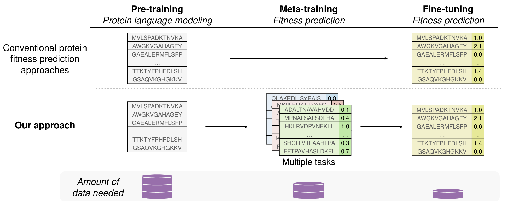

# Metalic: Meta-Learning In-Context with Protein Language Models

This repository implements the method presented in the paper "[METALIC: Meta-Learning In-Context with Protein Language Models](https://arxiv.org/abs/2410.08355)" (Beck et al., 2024). We introduce Metalic, an approach that uses foundation models, in-context learning over related tasks, and fine-tuning for protein fitness prediction. Metalic achieves state-of-the-art results on ProteinGym with less computation and fewer parameters.



Protein language models (PLMs) are trained over massive quantities of unlabeled data. Using meta-learning, we also train over a smaller quantity of labelled fitness data. Using this extra data is critical given limited data for fine-tuning at test time.

## 🚀 How to Run

To setup and execute a meta-learning experiment, see an example using the following command from the root of the `metalic/` repository:

```bash
bash ./run_meta_supervised.sh
```

The config files can be found at:

- `meta/config/metasupervised.yaml` (experiment)
- `meta/config/task/gym_metasupervised.yaml` (evaluation)
- `meta/config/surrogate/metanpt.yaml` (model and training)

Running a command, such as the following, may be useful for debugging:

```
python run_metasupervised.py +experiment/metasupervised=gym experiment_group=meta_test logging.tags=["test1"] logging.type=terminal surrogate.train_config.batch_sz=2 surrogate.train_config.support_size=2 surrogate.train_config.query_size=4
```

Note: Experiments were run with python 3.10.11

## 🏁 Model Checkpoints

All the checkpoints for the metalic models can be found [here](https://huggingface.co/datasets/InstaDeepAI/metalic/tree/main) on HuggingFace.
The checkpoints are trained for the zeroshot setting on single mutant landscapes from ProteinGym, for all three seeds. 
Referring to the model names described in the paper, _Metalic_ checkpoints can be found [here](https://huggingface.co/datasets/InstaDeepAI/metalic/tree/main/single_zeroshot) 
and _Metalic_AuxIF_ (trained with auxiliary scores from the ESM Inverse Folding model) checkpoints can be found [here](https://huggingface.co/datasets/InstaDeepAI/metalic/tree/main/single_zeroshot_auxESMIF) (please refer to the paper for more details on the inverse folding model).

## 📖 Citation

If you use this code, please cite one of the following papers:

```bibtex
@inproceedings{{beck2024metalic,
  title={Metalic: Meta-Learning In-Context with Protein Language Models},
  author={Beck, Jacob and Surana, Shikha and McAuliffe, Manus and Bent, Oliver 
  and Barrett, Thomas D and Garau-Luis, Juan Jose and Duckworth, Paul},
  booktitle={arXiv},
  year={2024},
}}
@inproceedings{{beck2024metalic,
  title={Metalic: Meta-Learning In-Context with Protein Language Models},
  author={Beck, Jacob and Surana, Shikha and McAuliffe, Manus and Bent, Oliver 
  and Barrett, Thomas D and Garau-Luis, Juan Jose and Duckworth, Paul},
  booktitle={Neurips 2024 Workshop Foundation Models for Science},
  year={2024},
}}
```
